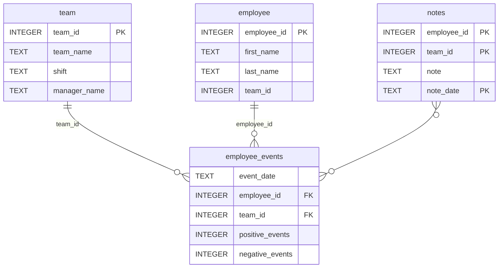

# Software Engineering for Data Scientists 

This repository contains starter code for the **Software Engineering for Data Scientists** final project. Please reference your course materials for documentation on this repository's structure and important files. Happy coding!

### Repository Structure
```
├── README.md
├── assets
│   ├── model.pkl
│   └── report.css
├── env
├── python-package
│   ├── employee_events
│   │   ├── __init__.py
│   │   ├── employee.py
│   │   ├── employee_events.db
│   │   ├── query_base.py
│   │   ├── sql_execution.py
│   │   └── team.py
│   ├── requirements.txt
│   ├── setup.py
├── report
│   ├── base_components
│   │   ├── __init__.py
│   │   ├── base_component.py
│   │   ├── data_table.py
│   │   ├── dropdown.py
│   │   ├── matplotlib_viz.py
│   │   └── radio.py
│   ├── combined_components
│   │   ├── __init__.py
│   │   ├── combined_component.py
│   │   └── form_group.py
│   ├── dashboard.py
│   └── utils.py
├── requirements.txt
├── start
├── tests
    └── test_employee_events.py
```

### employee_events.db


## Setup

### Create and activate a virtual environment

```bash
python -m venv venv
source venv/bin/activate
```

### Install project dependencies

```bash
pip install -r requirements.txt
```

### Install the Python package

```bash
pip install -e ./python-package
```

## Running Tests

Run the project tests:

```bash
python -m pytest tests/test_employee_events.py -v
```

## Building the Python Package

Create the source distribution archive:

```bash
cd python-package
python -m build --sdist
```

The package archive will be created in:

```text
python-package/dist/
```

## Running the Dashboard

Start the dashboard application:

```bash
python report/dashboard.py
```

The dashboard is available at:

```text
http://localhost:5001
```

## Project Features

- Python package for querying employee and team data
- SQLite database integration
- Object-oriented design using inheritance and mixins
- Interactive dashboard built with FastHTML
- Employee and team performance visualizations
- Recruitment risk prediction using a machine learning model
- Automated testing with pytest
- GitHub Actions for testing and linting
